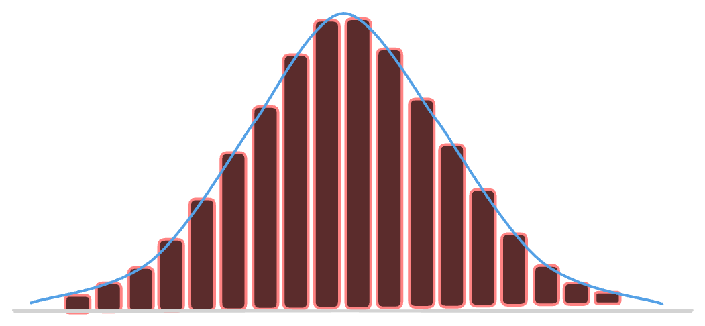
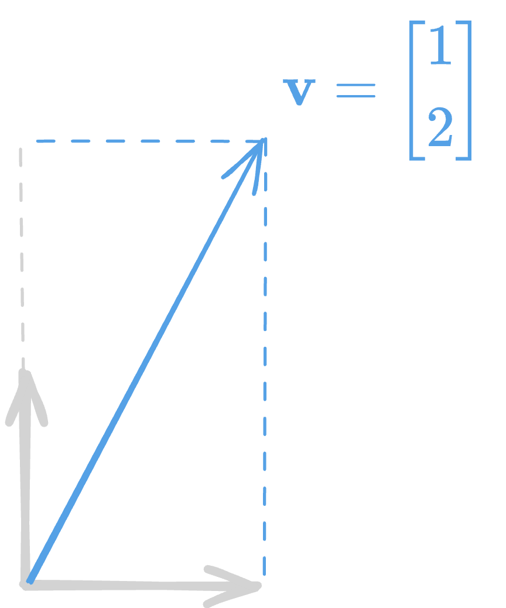
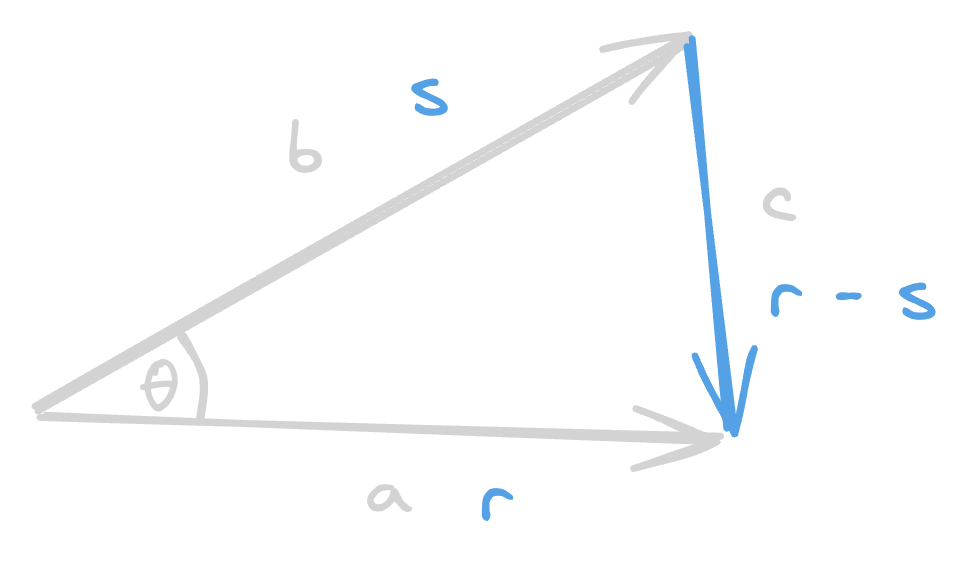
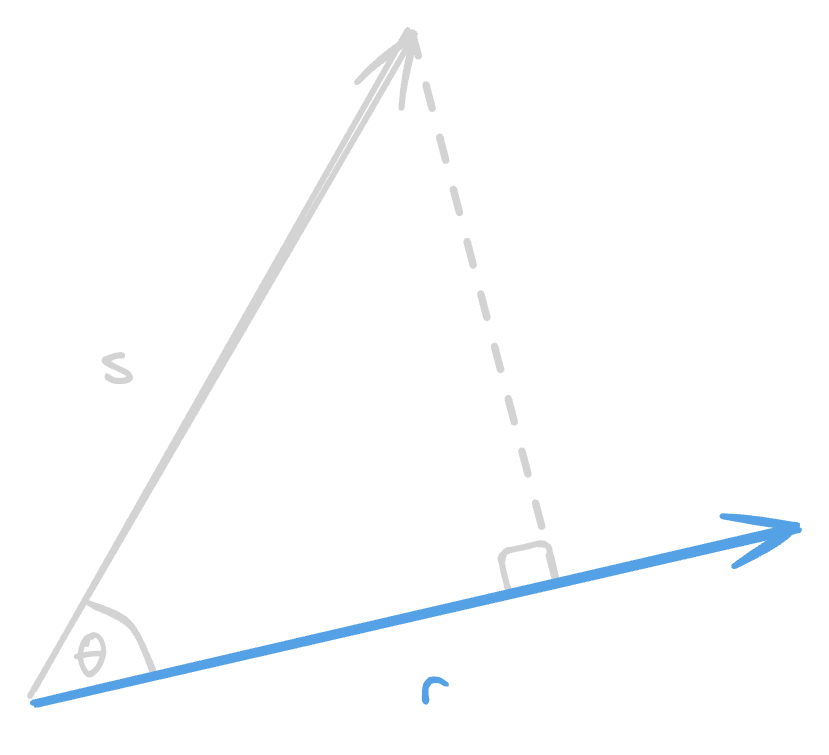

In this post, we will depart from the fundamentals of vectors and arrive at matrices as transformation of basis, exploring the mathematical intuition behind reference frames, eigenvalues, and eigenvectors. The content presented here is heavily based from notes I personally took while following [Prof David Nye](https://profiles.imperial.ac.uk/david.dye)'s course on ["Mathematics for Machine Learning"](https://www.coursera.org/learn/linear-algebra-machine-learning?specialization=mathematics-machine-learning), which I highly recommend you take it. Big thanks to him for having such a great teaching style and personality.

We first begin by motivating the application of _linear algebra_ to the field of data science, followed-up by some basic definitions on the properties and operations of vectors. Then, matrices are introduced and their purpose is explained with respect to the transformation of space.

---

A fundamental application of linear algebra is solving sets of simultaneous equations:

$$
\begin{align}
2a + 3b &= 8 \\
10a + 1b &= 13 \\
\end{align}
\quad \text{is equivalent to} \quad
\begin{bmatrix}
2 & 3 \\
10 & 1
\end{bmatrix}
\begin{bmatrix} a \\ b \end{bmatrix}
=\begin{bmatrix} 8 \\ 13 \end{bmatrix}
$$

Where we employ vectors and matrices to solve them through the use of a special operation called the _inverse_, which we will later introduce.

Another typical use case is that of fitting a curve to a dataset that best describes it:

Although we will not yet show how to achieve this, you must at least be aware that plenty of fields in the real world use methods like _polynomial regression_ to approximate these curves in order to help them predict new observations. Some of the more prominent being healthcare, economics, and environmental science.

All in all, we see these kinds of problems all the time, from simpler linear regression models to more complex supply chain management. Linear algebra truly is the backbone of data science and knowing its foundations really well will definitely set you apart and allow you to better understand the mathematics behind most of your tools.

# Vectors

A vector $\mathbf{v} \in \mathbb{R}^{n}$ is an ordered tuple of $n$ scalars. We can think of vectors as points in space, directions, or quantities that have both magnitude and direction. For example, a vector in two-dimensional space is written as $\mathbf{v} = \begin{bmatrix} v_1 \\ v_2 \end{bmatrix}$, and in three-dimensional space as $\mathbf{v} = \begin{bmatrix} v_1 \\ v_2 \\ v_3 \end{bmatrix}$.

Note here that we are using a different notation for vectors than what you might find when you open a traditional linear algebra textbook. In machine learning, it is convention to define vectors as $\mathbf{u}$ instead of $\vec{u}$, however, both notations are valid and you should use whichever you are more comfortable working with. Just be aware that for the duration of this post I will be adhering to the former convention.

## Modulus

We express the ***modulus***, or magnitude, of a vector $\mathbf{v}$ as follows:

$$
|\mathbf{v}| = \sqrt{\sum_{i=1}^{n} v^{2}_i}
$$

Thereby, for a two-dimensional vector, we would say:

$$
|\mathbf{v}| = \sqrt{v_{1}^{2} + v_{2}^{2}}
$$

Geometrically, the modulus can be understood as the length or distance of the arrow from the origin. In the example seen in Figure 2, we can compute said distance as $|\mathbf{v}| = \sqrt{1^2 + 2^2} = \sqrt{5}$.

We see this operation embedded in many others, which is why I deemed crucial that we first begin by presenting it. In reality, this is a trivial calculation, however, its properties extend to many others. A clear example of this is found in the relationship between the dot product of two vectors and their angle. But, what kind of product is that?

## Dot Product

The ***dot product*** of two vectors yields a scalar value, and we express it as follows:

$$
\mathbf{r} \cdot \mathbf{s} = \sum\limits_{i=1}^{n} r_{i} s_{i}
$$

Which is an operation that attends to the following properties:

- **Commutative.**

$$
\begin{aligned}
\mathbf{r} \cdot \mathbf{s} &= r_{1} s_{1} + r_{2} s_{2} + \dots + r_{n} s_{n} \\
&= s_{1} r_{1} + s_{2} r_{2} + \dots + s_{n} r_{n} \\
&= \mathbf{s} \cdot \mathbf{r}
\end{aligned}
$$

- **Distributive over Addition.**

$$
\begin{aligned}
\mathbf{r} \cdot (\mathbf{s} + \mathbf{t}) &= r_{1}(s_{1}+ t_{1}) + r_{2}(s_{2}+t_{2}) + \dots + r_{n}(s_{n} + t_{n}) \\
&= r_{1} s_{1} + r_{1} t_{1} + r_{2} s_{2} + r_{2} t_{2} + \dots + r_{n} s_{n} + r_{n} t_{n} \\
&= \mathbf{r} \cdot \mathbf{s} + \mathbf{r} \cdot \mathbf{t}
\end{aligned}
$$

- **Associative over Scalar Multiplication.**

$$
\begin{aligned}
\mathbf{r} \cdot(a \mathbf{s}) &= r_{1}(as_{1})+ r_2(as_{2}) + \dots + r_{n} (a s_{n}) \\
&= a(r_{1} s_{1} + r_{2} s_{2} + \dots + r_{n} s_{n}) \\
&= a (\mathbf{r} \cdot \mathbf{s})
\end{aligned}
$$

By looking at the cosine rule, we can derive a property of the dot product that relates the angle between two vectors to the operation's result.

Recall the cosine rule:

$$
c^{2}= a^{2} + b^{2} - 2ab\cos{\theta}
$$

Substitute with vector notation:

$$
| \mathbf{r} - \mathbf{s} |^{2} = |\mathbf{r}|^{2} + |\mathbf{s}|^{2} - 2|\mathbf{r}| |\mathbf{s}| \cos{\theta}
$$

Extend the left-hand side of the equation, knowing that $|\mathbf{v}|^{2} = \left( \sqrt{\mathbf{v} \cdot \mathbf{v}} \right)^{2} = \mathbf{v} \cdot \mathbf{v}$:

$$
\begin{aligned}
|\mathbf{r} - \mathbf{s}|^{2} &= (\mathbf{r} - \mathbf{s}) \cdot (\mathbf{r} - \mathbf{s}) \\
&= \mathbf{r} \cdot \mathbf{r} - \mathbf{s} \cdot \mathbf{r} - \mathbf{s} \cdot \mathbf{r} - \mathbf{s} \cdot (- \mathbf{s}) \\
&= |\mathbf{r}|^{2} - 2 \cdot \mathbf{s} \cdot \mathbf{r} + |\mathbf{s}|^2
\end{aligned}
$$

Substitute the new form in the previous equation:

$$
|\mathbf{r}|^{2} - 2 \cdot \mathbf{s} \cdot \mathbf{r} + |\mathbf{s}|^{2} = |\mathbf{r}|^{2} + |\mathbf{s}|^{2} - 2 |\mathbf{r}| |\mathbf{s}| \cos{\theta}
$$

Simplify terms:

$$
\begin{aligned}
\cancel{|\mathbf{r}|^{2}} \cancel{- 2} \cdot \mathbf{s} \cdot \mathbf{r} + \cancel{|\mathbf{s}|^{2}} &= \cancel{|\mathbf{r}|^{2}} + \cancel{|\mathbf{s}|^{2}} \cancel{- 2}|\mathbf{r}||\mathbf{s}| \cos{\theta} \\
\mathbf{s} \cdot \mathbf{r} &= |\mathbf{r}||\mathbf{s}|\cos{\theta} \\
\end{aligned}
$$

Therefore, the result of the dot product of two vectors is in direct relation to their magnitudes and the angle they form. This entails that when they are $90^\circ$ with respect to each other, the result of their dot product is $\mathbf{s} \cdot \mathbf{r} = 0$, when they are at $0^\circ$ then it is $1$, and when they are at $180^\circ$ then it is $-1$.

## Scalar Projection

We understand the term *scalar projection* as the length of the “shadow” that is cast from one vector to another, which is closely linked with the angle that they form.

Stemming from trigonometry, we recall:

$$
\cos \theta = \frac{\text{adj}}{\text{hyp}}
$$

Substitute and re-arrange with vector notation:

$$
\begin{aligned}
\cos \theta &= \frac{\textit{scalar proj}_{\mathbf{r}}\mathbf{s}}{|\mathbf{s}|} \\
\textit{scalar proj}_{\mathbf{r}}\mathbf{s} &= |\mathbf{s}| \cos \theta
\end{aligned}
$$

Pair it with the previous definition of the dot product:

$$
\begin{aligned}
\mathbf{r} \cdot \mathbf{s} &= |\mathbf{r}||\mathbf{s}| \cos \theta \\
&= |\mathbf{r}| \cdot \textit{scalar proj}_{\mathbf{r}}\mathbf{s}
\end{aligned}
$$

Thereby, when $\theta = 90^\circ$ ($\mathbf{r}$ and $\mathbf{s}$ are perpendicular to each other), then $\textit{scalar proj}_{\mathbf{r}}\mathbf{s} = 0$.

Finally, we can relate the dot product with the scalar projection:

$$
\frac{\mathbf{r} \cdot \mathbf{s}}{|\mathbf{r}|} = |\mathbf{s}| \cos \theta = \textit{scalar proj}_{\mathbf{r}}\mathbf{s}
$$

Which we can re-formulate as:

$$
\cos \theta = \frac{\mathbf{r} \cdot \mathbf{s}}{|\mathbf{r}| |\mathbf{s}|}
$$

Therefore, we have linked the dot product equation with the scalar projection formula.

## Vector Projection

To encode the direction of $\mathbf{r}$ into the scalar projection, we can do as follows:

$$
\textit{proj}_{\mathbf{r}}\mathbf{s} = \left( \frac{\mathbf{r} \cdot \mathbf{s}}{|\mathbf{r}|^{2}} \right) \cdot \mathbf{r}
$$

Which results in the *vector projection* of $\mathbf{s}$ over $\mathbf{r}$, where the result is a vector.
